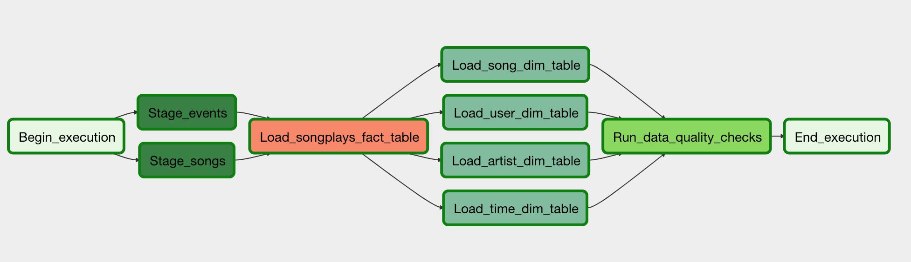

# Data Pipelines with Airflow
A music streaming company, Sparkify, has decided that it is time to introduce more automation and monitoring to their data warehouse ETL pipelines and come to the conclusion that the best tool to achieve this is Apache Airflow.

They have decided to bring you into the project and expect you to create high grade data pipelines that are dynamic and built from reusable tasks, can be monitored, and allow easy backfills. They have also noted that the data quality plays a big part when analyses are executed on top the data warehouse and want to run tests against their datasets after the ETL steps have been executed to catch any discrepancies in the datasets.

The source data resides in S3 and needs to be processed in Sparkify's data warehouse in Amazon Redshift. The source datasets consist of CSV logs that tell about user activity in the application and JSON metadata about the songs the users listen to.

## Data Source 
* Log data: `s3://udacity-dend/log_data`
* Song data: `s3://udacity-dend/song_data`

## Project Strucute
* README: Current file, holds instructions and documentation of the project
* dags/sparkify_dag.py: Directed Acyclic Graph definition with imports, tasks and task dependencies
* dags/create_tables.sql: Contains SQL Table creations statements
* imgs/dag.png: DAG visualization
* plugins/helpers/sql_queries.py: Contains Insert SQL statements
* plugins/operators/stage_redshift.py: Operator that copies data from S3 buckets into redshift staging tables
* plugins/operators/load_dimension.py: Operator that loads data from redshift staging tables into dimensional tables
* plugins/operators/load_fact.py: Operator that loads data from redshift staging tables into fact table
* plugins/operators/data_quality.py: Operator that validates data quality in redshift tables

## Project Setup
**AWS Connection**
Conn Id: Enter aws_credentials.
Conn Type: Enter Amazon Web Services.
Login: Enter your Access key ID from the IAM User credentials you downloaded earlier.
Password: Enter your Secret access key from the IAM User credentials you downloaded earlier.

**Redshift Connection**
Conn Id: Enter redshift.
Conn Type: Enter Postgres.
Host: Enter the endpoint of your Redshift cluster, excluding the port at the end. 
Schema: This is the Redshift database you want to connect to.
Login: Enter awsuser.
Password: Enter the password created when launching the Redshift cluster.
Port: Enter 5439.

### Operators
Operators create necessary tables, stage the data, transform the data, and run checks on data quality.

Connections and Hooks are configured using Airflow's built-in functionalities.

All of the operators and task run SQL statements against the Redshift database. 

#### Stage Operator
The stage operator loads any JSON and CSV formatted files from S3 to Amazon Redshift. The operator creates and runs a SQL COPY statement based on the parameters provided. The operator's parameters should specify where in S3 the file is loaded and what is the target table.

- Instead of running a static SQL statement to stage the data, the task uses params to generate the copy statement dynamically. It also contains a templated field that allows it to load timestamped files from S3 based on the execution time and run backfills.

- The operator contains logging in different steps of the execution

- The SQL statements are executed by using a Airflow hook

#### Fact and Dimension Operators
The dimension and fact operators make use of the SQL helper class to run data transformations. Operators take as input the SQL statement from the helper class and target the database on which to run the query against. A target table is also defined that contains the results of the transformation.

Dimension loads are done with the truncate-insert pattern where the target table is emptied before the load. There is a parameter that allows switching between insert modes when loading dimensions. Fact tables are massive so they only allow append type functionality.

- Dimensions are loaded with on the LoadDimension operator

- Facts are loaded with on the LoadFact operator

- Instead of running a static SQL statement to stage the data, the task uses params to generate the copy statement dynamically

#### Data Quality Operator
The data quality operator is used to run checks on the data itself. The operator's main functionality is to receive one or more SQL based test cases along with the expected results and execute the tests. For each the test, the test result and expected result are checked and if there is no match, the operator raises an exception and the task is retried and fails eventually.

- Data quality check is done with correct operator

- The DAG either fails or retries n times

- Operator uses params to get the tests and the results, tests are not hard coded to the operator

### After successful execution of the DAG
- The task dependencies should generate the following graph view:
